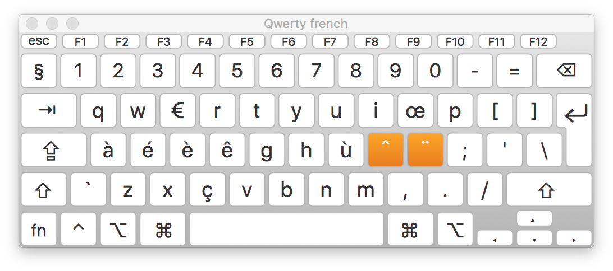

# Keyboard Layouts ~ optimized for French

This repo features some new Keyboards Layouts with faster access to french accents. I was not satisfied with the way they are handled in Qwerty and Qwerty International on MacOS X : key shortcuts are cumbersome and tend to break your workflow. I came upon [Qwerty Lafayette](http://qwerty-lafayette.org) but was not entirely satisfied thus I made this one with the modification of only 1 key : `;` which becomes a dead key for a fast access to the most used accents (left hand) and for other dead keys (right hand).

Once you hit the dead key, you'll get the following layout :

Thus you can simply type `;s` to output `é` without leaving the home row.

## Installation

Copy the file `Qwerty-french.bundle` to `~/Library/Keyboard Layouts/` and select the new layout `Qwerty-french`.

## Note

Made with the excellent [Ukelele](http://scripts.sil.org/cms/scripts/page.php?site_id=nrsi&id=ukelele) program.
